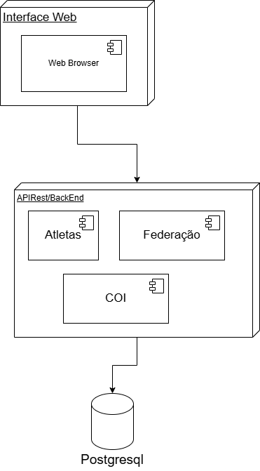

# Sistema de Gestão das Olimpíadas (SGO)

## Casos de Uso

### Atleta
- **UC01 - Criar Perfil de Atleta**  
  O atleta realiza o cadastro de seu perfil com informações pessoais e federação para poder participar das competições.

- **UC02 - Editar Perfil de Atleta**  
  O atleta pode atualizar dados pessoais e esportivos sempre que necessário.

- **UC03 - Visualizar Competições Disponíveis**  
  O atleta consulta as competições abertas da sua modalidade.

- **UC04 - Inscrever-se em Competição**  
  O atleta escolhe e realiza sua inscrição em uma competição específica.

- **UC05 - Cancelar Inscrição em Competição**  
  O atleta pode cancelar sua inscrição antes do prazo limite definido.

- **UC06 - Visualizar Minhas Competições**  
  O atleta acessa a lista de competições nas quais está inscrito, com datas e horários.

- **UC07 - Receber Notificações de Alterações**  
  O atleta é notificado em caso de mudanças de horário, local ou status de uma competição.

- **UC08 - Consultar Resultados e Desempenho**  
  O atleta visualiza seus resultados e desempenho após cada competição.

---

###  Federação
- **UC09 - Gerenciar Atletas da Federação**  
  A federação cadastra, atualiza e remove atletas sob sua responsabilidade.

- **UC10 - Visualizar Inscrições dos Atletas**  
  A federação acompanha as competições em que seus atletas estão inscritos.

- **UC11 - Validar Inscrições dos Atletas**  
  A federação confirma a regularidade dos atletas e autoriza suas participações.

- **UC12 - Consultar Desempenho dos Atletas**  
  A federação acompanha os resultados individuais e por modalidade dos seus atletas.

- **UC13 - Enviar Relatórios ao Comitê Olímpico**  
  A federação gera e envia relatórios consolidados de desempenho para o comitê.

---

###  Comitê Olímpico Internacional 
- **UC14 - Cadastrar Competições**  
  O comitê cria novas competições informando modalidade, data, horário e local.

- **UC15 - Editar Informações de Competições**  
  O comitê pode alterar informações das competições antes do início.

- **UC16 - Cancelar Competições**  
  O comitê cancela competições e notifica atletas e federações afetados.

- **UC17 - Visualizar Lista de Inscritos**  
  O comitê consulta todos os atletas inscritos em uma competição específica.

- **UC18 - Registrar Resultados das Competições**  
  O comitê insere os resultados finais, incluindo medalhistas de ouro, prata e bronze.

- **UC19 - Gerar Relatórios de Desempenho**  
  O comitê gera relatórios de desempenho por atleta, federação e país.
- **UC20 - Monitorar Quadro de Medalhas**  
  O comitê acompanha e atualiza o quadro geral de medalhas em tempo real.

- **UC21 - Validar Conformidade das Federações e Atletas**  
  O comitê verifica se as federações e atletas estão de acordo com as regras oficiais do evento.

## Diagramas do Sistema de Gestão de Olimpíadas

### Diagrama de Caso de Uso

### Diagrama de Classes

### Diagrama de Componentes

### Diagrama de Implementação

### Diagrama de Pacotes

